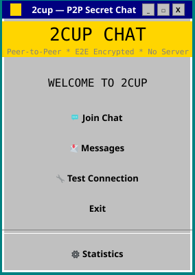
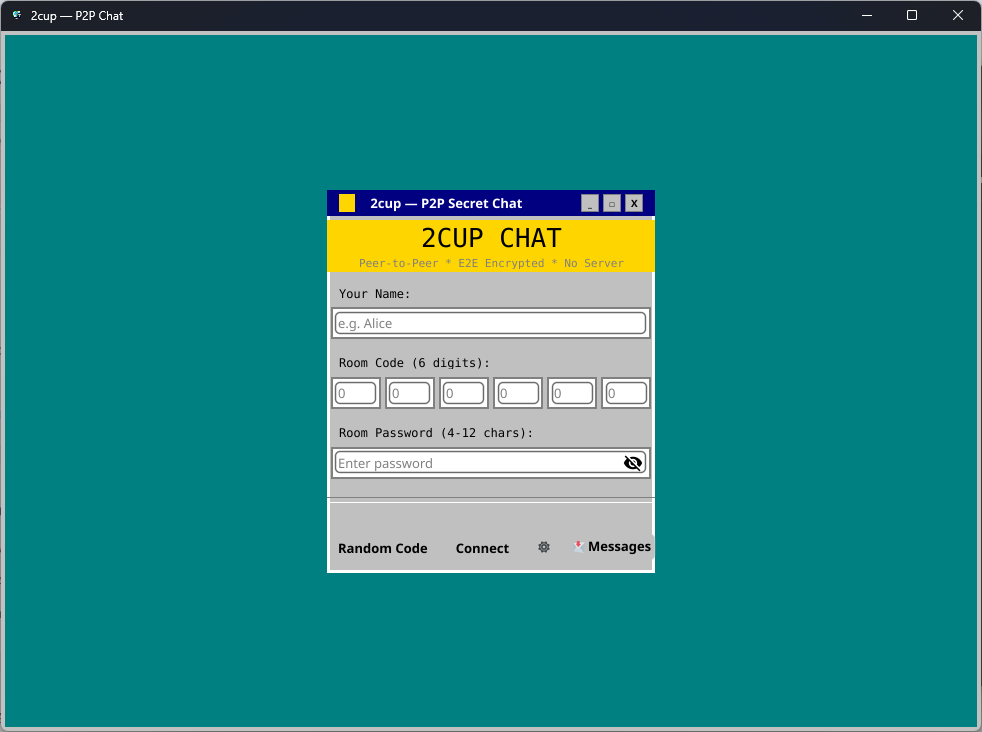
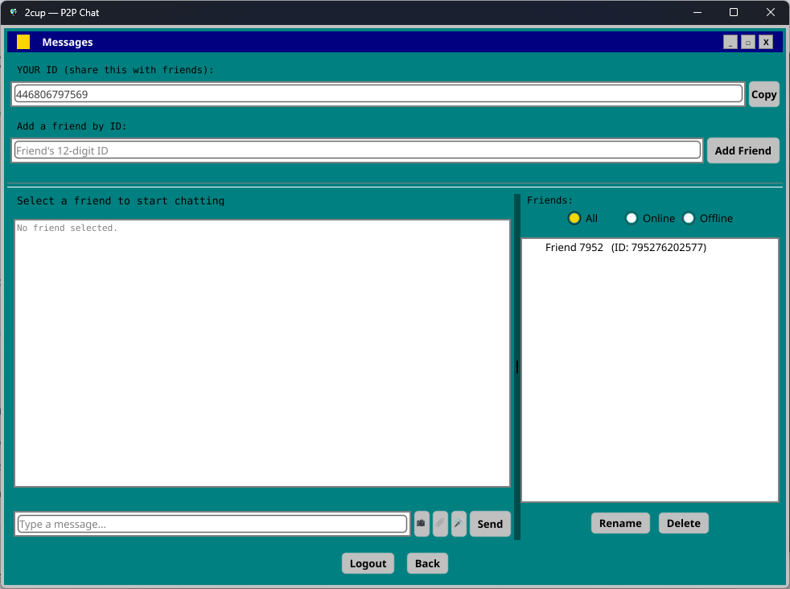

<<<<<<< HEAD
## Screenshots

| Main menu | Join Chat | Messages |
|---|---|---|
|  |  |  |
=======
# 2cup Chat

A serverless, peer-to-peer, end-to-end encrypted chat application for Windows, built in Go with a retro Windows 95-style UI (via [Fyne](https://fyne.io)) and [libp2p](https://libp2p.io) for networking.

There is no central server: peers discover each other through a public DHT, connect directly (with relay/hole-punching fallback for NAT/CGNAT), and exchange messages that are end-to-end encrypted before they ever leave your machine.


## Features

- **Join Chat** — create or join a 6-digit room code protected by a password. Messages, images, and voice notes in the room are encrypted with a key derived from the code + password (NaCl `secretbox`).
- **Messages (1:1 DMs)** — register an account (email/password, stored locally only) to get a permanent 12-digit ID and a public/private keypair (NaCl `box`). Add friends by ID and exchange end-to-end encrypted text, photos, voice notes, and files. Delivery is attempted via a direct libp2p stream first, falls back to Pub/Sub, and finally to a swarm-relay store-and-forward cache if the recipient is offline.
- **No server required** — peer discovery and NAT traversal via a Kademlia DHT, GossipSub, AutoRelay, and hole punching. Any 2cup peer detected as publicly reachable automatically offers itself as a relay for others stuck behind CGNAT.
- **Local statistics** — tracks peak concurrent online peers per day/month, viewable in a small in-app dashboard.
- **Built-in diagnostics** — a "Test Connection" screen that checks the libp2p host, listen addresses, peer connectivity, DHT round-trips, Pub/Sub, and the Messages account/DM listener, with human-readable explanations for common failure causes (firewall, no peers, etc.).
- **Optional autostart** — can register itself to launch silently at Windows sign-in (with user confirmation) so offline messages aren't missed, and hides its console window if built without `-H=windowsgui`.

## Screenshots

*(Add screenshots of the main menu, chat room, and Messages screen here.)*

## Requirements

- Windows 10/11
- [Go 1.21+](https://go.dev/dl/) to build from source
- A C compiler toolchain is **not** required (Fyne on Windows uses OpenGL via `golang.org/x/sys` and native Win32 calls in this project — no CGO-only native audio libs beyond the Windows `winmm.dll` API used directly via syscalls)

## Building from source

```bash
git clone https://github.com/<your-username>/2cup.git
cd 2cup
go build -ldflags "-H=windowsgui" -o 2cup.exe .
```

The `-H=windowsgui` flag is important — without it, Windows allocates a console window that stays open (and visible) for the lifetime of the app. Place `2cup.png` (the app icon, also used as the tray icon) next to `2cup.exe`.

### Run from source (development)

```bash
go run .
```

Note: `go run` and a plain `go build` (without `-ldflags "-H=windowsgui"`) will show a console window; the app tries to auto-hide it as a fallback, but building with the flag above is the correct fix.

## Running

Download `2cup.exe` and `2cup.png` from the [Releases](../../releases) page (or build them yourself) and place them in the same folder, then run `2cup.exe`.

- **Join Chat**: pick a display name, a 6-digit room code (share it with friends, or generate one randomly), and a password (4–12 characters). Everyone with the same code + password can see and decrypt the room's messages.
- **Messages**: register with an email + password (kept only on your device) to get a permanent ID. Share your ID with friends so they can add you, then chat 1:1 with end-to-end encryption.
- **Test Connection**: run this if peers aren't showing up — it walks through the network stack and tells you what's failing and why.

## How it works (architecture)

| Layer | Technology |
|---|---|
| UI | [Fyne](https://fyne.io) v2, custom Windows 95-themed widgets |
| P2P transport | [go-libp2p](https://github.com/libp2p/go-libp2p) (TCP + QUIC, AutoRelay, hole punching, NAT port mapping) |
| Peer/content discovery | [go-libp2p-kad-dht](https://github.com/libp2p/go-libp2p-kad-dht) |
| Pub/Sub messaging | [go-libp2p-pubsub](https://github.com/libp2p/go-libp2p-pubsub) (GossipSub) |
| Room encryption | NaCl `secretbox` (symmetric, key derived from room code + password) |
| DM encryption | NaCl `box` (asymmetric, per-user keypair) |
| Voice recording/playback | Windows MCI (`winmm.dll`) via `syscall` |
| Autostart | Windows Registry `Run` key |

## Security notes

- Room codes + passwords derive a symmetric key via SHA-256; anyone who knows both can decrypt that room's traffic. Don't reuse a password you use elsewhere.
- Direct-message keys are per-account NaCl keypairs; your private key is stored locally in your Windows user config folder and never leaves your device.
- This is a hobby/community project and has **not** had a formal security audit. Use it for casual, low-stakes communication rather than anything sensitive.
- As with any P2P software, your traffic may be routed through other peers acting as relays when a direct/NAT-punched connection isn't possible.

## Project status / contributing

Issues and pull requests are welcome. Please open an issue before submitting large changes so we can discuss the approach first.

## License

[MIT](LICENSE)
=======
# 2cup
>>>>>>> 94f417648b84f323ad08247014889aff163664cb
